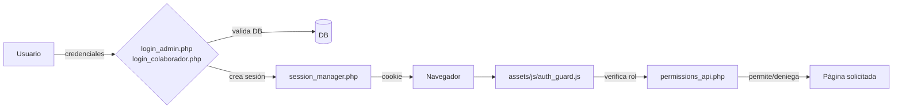
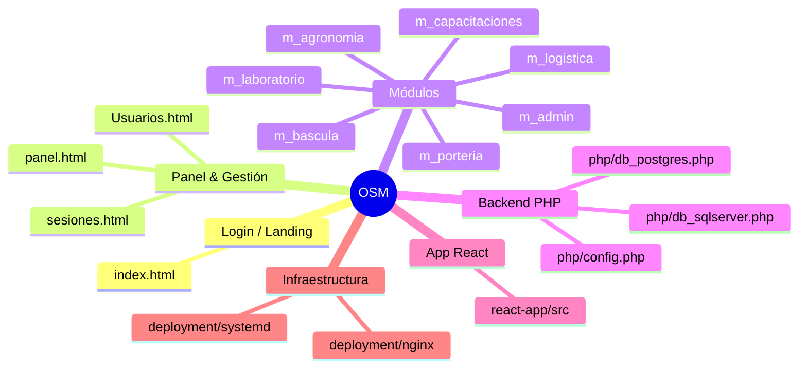

# OSM – Documentación General del Repositorio

## Tabla de contenidos
- [Visión general](#visión-general)
- [Arquitectura y flujos](#arquitectura-y-flujos)
- [Mapa de carpetas](#mapa-de-carpetas)
- [Páginas web clásicas (HTML)](#páginas-web-clásicas-html)
- [APIs y utilidades PHP](#apis-y-utilidades-php)
- [Aplicación React (`react-app`)](#aplicación-react-react-app)
- [Recursos compartidos (`assets` e `includes`)](#recursos-compartidos-assets-e-includes)
- [Módulos de negocio](#módulos-de-negocio)
- [Despliegue e infraestructura](#despliegue-e-infraestructura)
- [Datos y registros](#datos-y-registros)
- [Ejecución local y scripts útiles](#ejecución-local-y-scripts-útiles)

## Visión general
Idioma: **español** (coincide con la interfaz y los nombres de archivos). Añade traducciones según sea necesario para contribuir en inglés.

Este repositorio contiene la plataforma OSM con dos frentes principales:
- **Sitio web clásico** en HTML/JS (Bootstrap) protegido por roles y sesiones PHP.
- **Aplicación React** moderna (Vite + TypeScript) para experiencias nuevas o en transición.

## Arquitectura y flujos
```mermaid
graph TD
    A[Navegador] --> B[index.html (login)]
    B --> C{PHP<br>login_admin.php<br>login_colaborador.php}
    C --> D[session_manager.php<br>session_management_api.php]
    D --> E[permissions_api.php<br>roles_api.php]
    E --> F[HTML protegidos<br>panel, usuarios, sesiones, módulos]
    F --> G[APIs de negocio<br>web_main_api.php, web_main_upload.php]
    G --> H[(PostgreSQL / SQL Server)]
    F --> I[React App (Vite)]
```

Flujo de autenticación y autorización:


Mapa de módulos y navegación principal:


## Mapa de carpetas
| Carpeta / archivo | Propósito principal |
| --- | --- |
| `index.html` | Login público con selector de perfiles (colaborador / administrador). |
| `panel.html` | Panel principal con KPIs y widgets dinámicos. |
| `Usuarios.html` | Panel del usuario autenticado (datos personales y roles). |
| `sesiones.html` | Gestión de sesiones, intentos de acceso e historial. |
| `assets/` | Bootstrap, iconos, CSS, JS comunes (auth, roles, sidebar, logger). |
| `includes/` | Fragmentos reutilizables (navbar, sidebar, roles, web_main). |
| `php/` | APIs PHP de autenticación, permisos, sincronización y carga de archivos. |
| `m_*` | Módulos funcionales (admin, capacitación, logística, etc.). |
| `react-app/` | Aplicación Vite + React + TypeScript. |
| `deployment/` | Plantillas de despliegue (nginx, systemd, script de deploy). |
| `excel/` | Plantillas/formatos de soporte (remisiones, programación, control). |
| `logs/` | Carpeta destinada a registros en tiempo de ejecución. |

## Páginas web clásicas (HTML)
| Archivo | Descripción |
| --- | --- |
| `index.html` | Formulario de acceso con cambio de rol, efectos de partículas y validación JS. |
| `panel.html` | Dashboard con KPI de usuarios, pesadas y capacitaciones; usa `auth_guard.js`, `logger.js`, `sidebar.js` y `navbar.js`. |
| `Usuarios.html` | Ficha del usuario autenticado (datos, roles, sesiones). |
| `sesiones.html` | Tabs para sesiones activas, intentos y acciones; requiere autenticación. |

## APIs y utilidades PHP
| Archivo | Rol |
| --- | --- |
| `php/config.php` | Carga `.env`, define constantes (DB, timeouts, tamaños de carga). |
| `php/db_postgres.php`, `php/db_sqlserver.php` | Conectores a PostgreSQL y SQL Server. |
| `php/login_admin.php`, `php/login_colaborador.php` | Endpoints de autenticación por perfil. |
| `php/session_manager.php`, `php/session_management_api.php`, `php/logout*.php` | Ciclo de vida de sesión y cierre. |
| `php/permissions_api.php`, `php/roles_api.php`, `php/role_check.php`, `php/debug_permissions.php` | Resolución de roles/permisos y depuración. |
| `php/web_main_api.php`, `php/web_main_upload.php`, `php/funciones_sync.php`, `php/sync_colaboradores.php` | Operaciones de negocio, sincronizaciones y cargas de archivos. |
| `php/audit_logger.php`, `php/error_handler.php`, `php/security_headers.php`, `php/csrf_protection.php` | Seguridad, auditoría y manejo de errores. |
| `php/list_tables.php`, `php/list_columns.php`, `php/list_situacion.php` | Utilidades de introspección/consulta. |

## Aplicación React (`react-app`)
- **Stack:** Vite, React 19, TypeScript, Tailwind 4, Axios, React Router 7, Recharts.
- **Estructura clave:**
  - `src/main.tsx`, `src/App.tsx`: arranque y rutas.
  - `src/layouts/MainLayout.tsx`, `src/layouts/AuthLayout.tsx`: contenedores de página.
  - `src/pages/HomePage.tsx`, `src/pages/LoginPage.tsx`: vistas principales.
  - `src/contexts/AuthProvider.tsx`: contexto de autenticación.
  - `src/services/api.ts`, `src/services/dashboardService.ts`: clientes HTTP y servicios de datos.
  - `src/utils/exportUtils.ts`: utilidades de exportación/Excel.
- **Estructura real (resumen de carpetas/archivos en `src/`):**
  ```
  src/
  ├─ App.tsx / App.css / index.css / main.tsx
  ├─ assets/ (iconos, imágenes)
  ├─ components/
  │  ├─ layout/ (navegación, contenedores)
  │  └─ ui/ (componentes reutilizables)
  ├─ contexts/
  │  └─ AuthProvider.tsx
  ├─ layouts/
  │  ├─ AuthLayout.tsx
  │  └─ MainLayout.tsx
  ├─ pages/
  │  ├─ HomePage.tsx, LoginPage.tsx
  │  ├─ admin/
  │  ├─ agronomia/
  │  ├─ bascula/
  │  ├─ capacitaciones/
  │  ├─ laboratorio/
  │  ├─ logistica/
  │  └─ porteria/          (cada una con `components/` y `services/` específicos)
  ├─ services/
  │  ├─ api.ts
  │  └─ dashboardService.ts
  └─ utils/
     └─ exportUtils.ts
  ```
- **Scripts disponibles:** `npm run dev`, `npm run build`, `npm run lint`, `npm run preview`.

## Recursos compartidos (`assets` e `includes`)
- `assets/js/`: autenticación (`auth_guard.js`, `enforce_permissions.js`), navegación dinámica (`sidebar.js`, `navbar.js`, `component_loader.js`), roles (`roles.js`, `user_trainings.js`), utilidades (`logger.js`, `chart.js`, `main.js`, `web_config.js`, `web_main_manager.js`, `sesiones.js`, `sweetalert2.all.min.js`, `xlsx.full.min.js`).
- `assets/css/`: temas Bootstrap y estilos de login/panel.
- `includes/`: fragmentos HTML de navbar, sidebar, roles y plantillas `web_main`.

## Módulos de negocio
| Carpeta | Páginas destacadas | Función |
| --- | --- | --- |
| `m_admin/` | `ed_usuario.html`, `ed_uscolaboradores.html`, `php/usuarios_api.php`, `php/colaboradores_api.php` | Administración de usuarios y colaboradores. |
| `m_capacitaciones/` | `dashboard.html`, `programacion.html`, `programacion_evaluaciones.html`, `crear_evaluacion.html`, `items_formularios.html`, `realizar_evaluacion.html`, `mis_evaluaciones.html` | Gestión y ejecución de capacitaciones/evaluaciones. |
| `m_agronomia/` | `gestion_permisos_agronomia.html`, `tb_agronomia.html`, `f_cortes.html` | Gestión de permisos y cortes de agronomía. |
| `m_logistica/` | `programacion.html`, `remision.html` | Programación logística y remisiones. |
| `m_bascula/` | `operacion_pesaje.html`, `reportes_pesaje.html` | Operación y reportes de báscula/pesajes. |
| `m_laboratorio/` | `formulario_calidad.html`, `datos_tanques.html` | Control de calidad y datos de tanques. |
| `m_porteria/` | `control_acceso.html`, `inventario.html` | Control de acceso e inventario en portería. |

## Despliegue e infraestructura
- `deployment/nginx/osm-web.conf`: plantilla de servidor virtual para servir la app web y proxys PHP.
- `deployment/nginx/deploy.sh`: script de despliegue/recarga de configuración.
- `deployment/systemd/osm-web.service`: unidad systemd para levantar el servicio web.

## Datos y registros
- `excel/`: plantillas de negocio (programación de ingreso, control de vehículos, remisiones).
- `logs/`: destino para registros de aplicación/servidor (se deben rotar fuera del repo).

## Ejecución local y scripts útiles
```bash
# 1) Frontend React
cd react-app
npm ci              # instalar dependencias
npm run dev         # desarrollo (Vite, puerto 5173 por defecto)
npm run build       # build de producción
npm run lint        # linting

# 2) Sitio HTML + PHP
# Servir la raíz del proyecto con PHP >=8 y acceso a PostgreSQL/SQL Server.
# Configurar .env en la raíz (variables: DB_PG_*, DB_SQLSRV_*, SESSION_TIMEOUT, UPLOAD_MAX_SIZE, ENABLE_DEBUG).
php -S localhost:8000 -t .    # ejemplo de servidor embebido
```

### Notas rápidas
- Asegura variables de entorno en `.env` (no versionado) o en el sistema antes de levantar PHP.
- `auth_guard.js` protege todas las páginas internas; agrega nuevos HTML al registro de roles/permisos si es necesario.
- Las cargas y sincronizaciones usan `php/web_main_upload.php` y `php/funciones_sync.php`; revisa límites en `UPLOAD_MAX_SIZE`.
