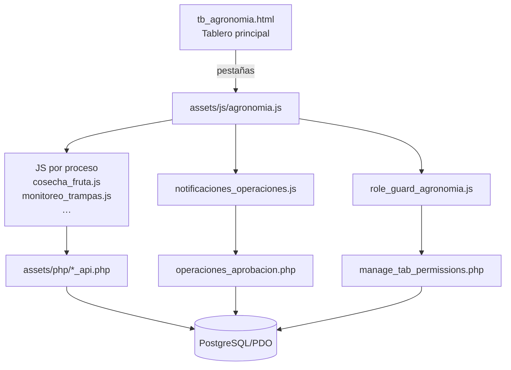
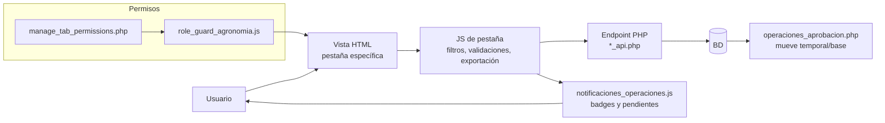

# Módulo de Agronomía

Documentación funcional y técnica del módulo de agronomía. Incluye vistas HTML, scripts de frontend y APIs PHP que gestionan monitoreos, auditorías, permisos y notificaciones.

## Mapa del módulo

## Vistas y carpetas

- `tb_agronomia.html`: tablero principal con pestañas y campana de pendientes.
- `f_cortes.html`: gestión de fecha de corte para restringir ediciones por rango.
- `gestion_permisos_agronomia.html`: panel de roles/permisos y visibilidad de pestañas.
- `assets/css/`: estilos específicos (material-super, tablas).
- `assets/js/`: lógica de UI (tabs, filtros, exportaciones) y módulos por proceso (cosecha, plagas, coberturas, etc.).
- `assets/php/`: APIs RESTful ligeras para cada entidad y utilidades de conexión/roles.
- `assets/config/`: configuraciones auxiliares usadas por el frontend.

## Flujo operativo

## Endpoints clave

- `*_api.php`: CRUD y flujo de aprobación para cada entidad (ej. `cosecha_fruta_api.php`).
- `operaciones_aprobacion.php`: helper para mover/aprobar registros entre tablas temporal/base.
- `fecha_corte.php`: lee/actualiza la fecha de corte (requiere rol administrador).
- `manage_tab_permissions.php`: asigna qué pestañas ve cada rol.
- `get_global_counts.php`: datos agregados para badges y notificaciones.

## Dependencias

- Frontend: Bootstrap, FontAwesome, SheetJS (`xlsx.full.min.js`) y componentes propios `material-super.js`.
- Backend: PHP 8+, extensiones PDO y pgsql; conexiones definidas en `assets/php/db*.php`.

## Despliegue y configuración

1. Configurar credenciales en `assets/php/db.php` y archivos `db_postgres_*.php`.
2. Verificar rutas relativas de includes en `assets/js/agronomia.js` (navbar/sidebar).
3. Revisar CORS si se expone `fecha_corte.php` o APIs desde otros dominios.

## Uso rápido

- Abrir `tb_agronomia.html` para operar tablas.
- Usar `f_cortes.html` para fijar/editar fecha de corte.
- Administrar visibilidad de pestañas en `gestion_permisos_agronomia.html`.
